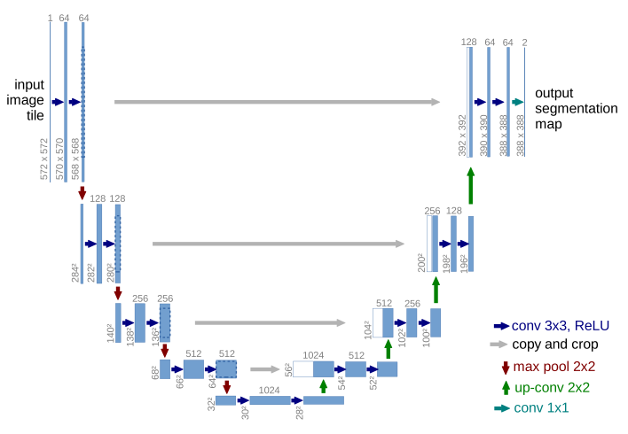
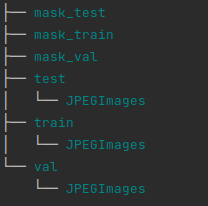
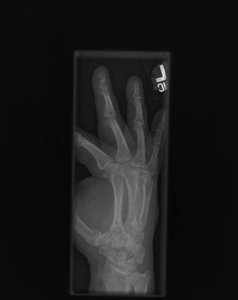
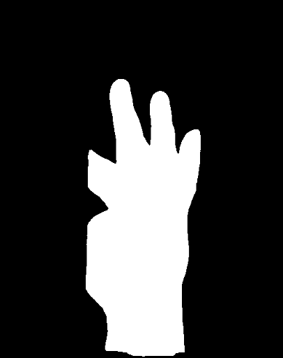

# Unet
Sementic segmentation in xray dataset

## Introduction

## Architecture



**Unet** consists of two parts a contracting side and an expansive side, and create
an elegant U shape architecture. Each side is composed of multiple layers which are built
from 3x3 convolution layers followed by ReLU and a 2x2 max pool. One impressive operation is 
up convolution and, to interpret it clearly, I recommend some explanations:
- [Up-sampling with transposed convolution](https://naokishibuya.medium.com/up-sampling-with-transposed-convolution-9ae4f2df52d0)
- [Understand transposed convolution](https://naokishibuya.medium.com/up-sampling-with-transposed-convolution-9ae4f2df52d0)
- [Deconvolution and Checkerboard Artifacts](https://distill.pub/2016/deconv-checkerboard/)

## Usage

### Dataset 

You have to format your dataset in the following manner:



### Training

```bash
$ python train.py --help
usage: train.py [-h] [--batch_size BATCH_SIZE] [--num_epochs NUM_EPOCHS] [--lr LR] [--num_workers NUM_WORKERS] [--weights WEIGHTS] [--image_size IMAGE_SIZE]

Training U-Net model for segmentation of xray

optional arguments:
  -h, --help            show this help message and exit
  --batch_size BATCH_SIZE
                        input batch size for training (default: 16)
  --num_epochs NUM_EPOCHS
                        number of epochs to train (default: 50)
  --lr LR               initial learning rate (default: 1e-3)
  --num_workers NUM_WORKERS
                        number of workers for data loading (default: 4)
  --weights WEIGHTS     Path to checkpoint (default: None)
  --image_size IMAGE_SIZE
                        input image size (default: 512)
```

### Inference

```bash
$ python predict.py --help

usage: predict.py [-h] [--image_path IMAGE_PATH] [--weights WEIGHTS] [--save_path SAVE_PATH]

Predict x-ray image

optional arguments:
  -h, --help            show this help message and exit
  --image_path IMAGE_PATH
                        path to image (default: None)
  --weights WEIGHTS     path to the checkpoint (default: None)
  --save_path SAVE_PATH
                        path to save image (default: None)
```
## Result



